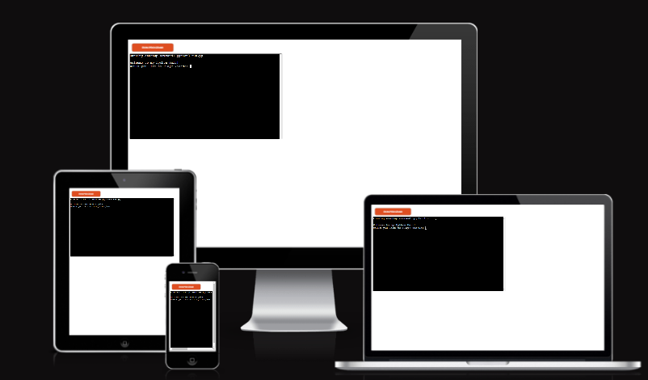
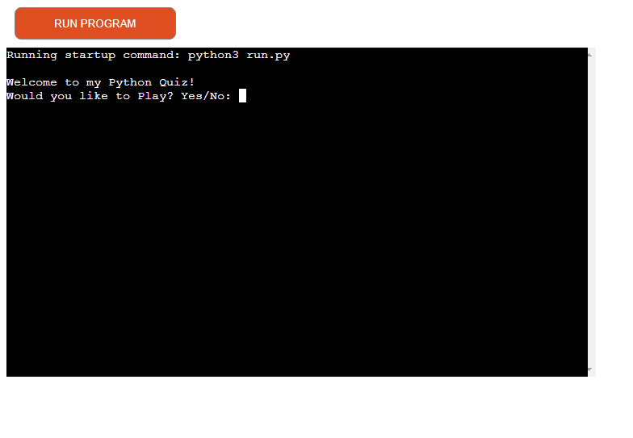
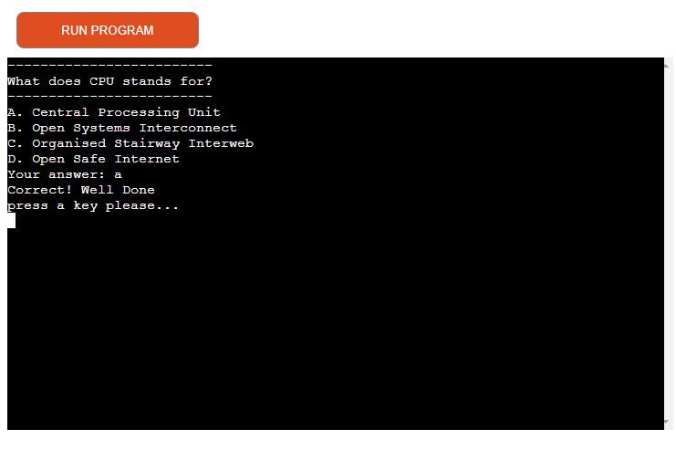
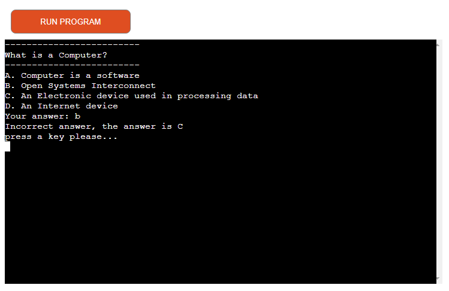
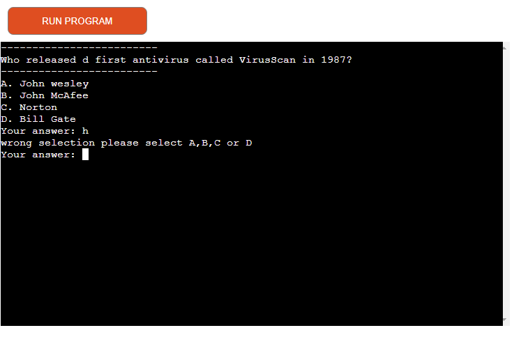
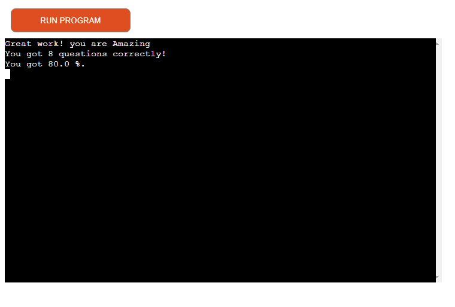
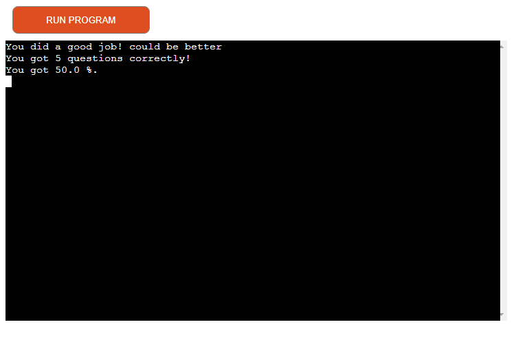
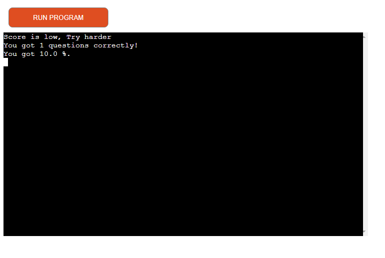
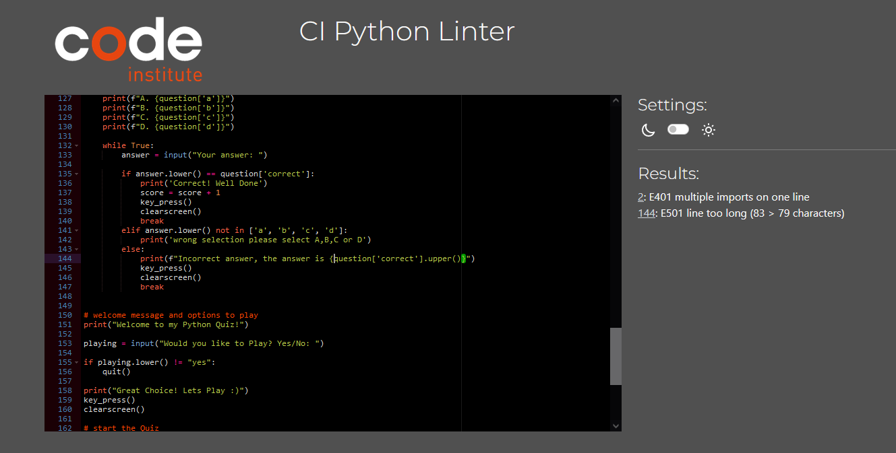
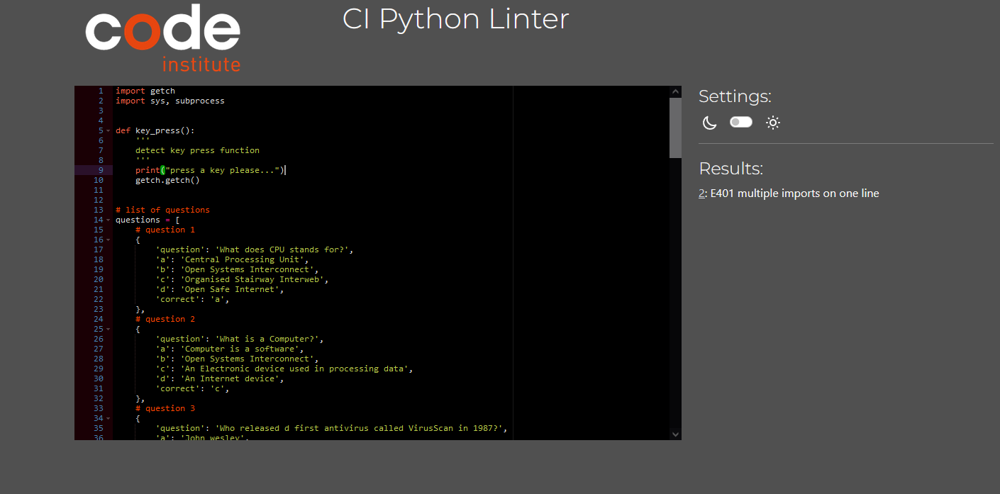

# Python Quiz Game

Heroku App: https://pythonquiz-a01f086ce4b8.herokuapp.com/<br>
GitHub: https://github.com/brightigiemokha/python_pc_quiz<br>


**Build a python quiz game that ask users to pick an answer from the options.**


## Guidelines and Guideline fulfilment

this project was designed for educational purpose and for fun. its super exciting and easy to play. you only have to pick an swer from the options provide and if you pick the correct answer you gate a pass and a score otherwide you are given the correct answer (just so you know it for next time) but no score will be added. at the end of this exciting game you get a total score for your performers and if the score is 70% and above you are given a great remark and if score is 50% and up to 60% you are given an encouraging remarks but if score is 0% to 40% you are advised to learn harder to become better. 
You have an option to choose to play or not in the beginning of the game.




## Demo

A live demo can be found [here](https://pythonquiz-a01f086ce4b8.herokuapp.com/). The Application was deployes by Heroku.

- - -

# Contents
* [Technologies Used](#technologies-used)
* [User Experience](#user-experience-ux)
* [Design](#design)
  * [Flowchart](#flowchart)
  * [Existing Features](#existing-features)
  * [Future Implementations](#future-implementations)
* [Deployment](#deployment)
  * [Heroku Deployment](#heroku-deployment)
  * [Run locally](#run-locally)
  * [Create data model and integrate using an API](#create-data-model-and-integrate-using-an-api)
* [Testing](#testing)
* [Credits](#credits)

- - - 

# Technologies Used
## Language
* Python3


## Frameworks & Tools
* Heroku Platform - to deploy the application into live enviroment
* Gitpod - to create the website
* Github - to store the repository of website and deploy it


For this project a [Code Institute template](https://github.com/Code-Institute-Org/python-essentials-template), which provides all the files I needed to run the mock terminal in the browser.

- - - 

# User Experience (UX)

## The ideal users for this website is:
* Python Quiz game is builth for everyone who have good knowledge of computer and python package. its informative and challenging. user will find it very exciting as it helps them solve the problem if they didnt know what the answer is at the end of each questions.


## User stories:

* As a new user you will easily understand what the game is about as you also have the option to chose if to play or not.
* You will be guided and informed how I can play the quiz 
* You will have a clear feedback from inputs
* You will have responds if wrong options are selected that are not related to quiz questions
* You will have option either to play again or to exit the program

## How to play:

- Firstly, The user is asked if they want to play the game and option from yes/No can be selected . if user select yes then the quiz game will run otherwise the game will quit. 
  the user needs to guess an answer for each question and there are option from A - D and if this is the correct option the user is congratulated and given a score otherwise, user is informed they picked the wrong answer and the correct answer is shown to the user before moving to next questions.
  There are 10 questions and if the user gets 7 - 10 questions correctly they get a beautiful remark for their effort and knowledge.
  If the user get 5 - 6 questions correctly , the user get remarks of encouragement to support their goal.
  If user get 0 - 4 questions correctly user get a remark advising them to study more and come back for a better experience.
  If User select an option that is not in the qestion A - D then the user is informed they have selected the wrong answer and need to use the options provided.


- - -

## Existing Features

### Introduction
- Once the user runs the program, Welcome to Python Quiz! Would you like to Play? is displayed, here the user have a choice to make. if user select yes then the game is lunched otherwise the game is closed.


### Username

- User is welcomed to the Quiz game and User is asked if they want to play the game. When the User select YES then the game starts otherwise the game is closed.



- When the correct input is entered the user get a responds back to confirm he had entered the correct answer. otherwise the user get responds to confirm user have entered an incorrect answer and the correct answer is displayed to the user.




- If user enters a invalid charactor or number, use will get a feedback of: Not a valid choice. and user is advised to select between A - D.








- If the user answer enough questions correctly up to 7 questions then the user gets a great score display.
- If the user answer few correct questions up to 5 then user get medium score display.
- If the user answers where wrong or only answer less than 5 questions correctly then user get low score display.


### Run program button
- The user can press the "RUN PROGRAM" button at any time to restart the program.


- - -
# Deployment
Gitpod IDE was used to write the code for this project and the Application has been deployed from GitHub to Heroku using the steps below with version releasing active.

## Heroku Deployment
Deployments steps are as follows, after account setup:

* Select New in the top-right corner of your Heroku Dashboard, and select Create new app from the dropdown menu.
* Add a unique app name and then choose a region closest to you (EU or USA).
* Click on Create App. 

In order for the project to run on Heroku, Heroku is needed to install the dependencies. 
* In the terminal write the following commando `pip3 freeze > requirements.txt` to create a list of requirements. The list of dependencies will go into `requirements.txt` file.


* Further down, to support dependencies, select Add Buildpack.
* The order of the buildpacks is important, select Python first, then click "Save changes". Then add Node.js second and click "Save changes" again. If they are not in this order, you can drag them to rearrange them.
* Go to "Deploy" and select "GitHub" in "Deployment method".
* To connect Heroku app to your Github repository code enter your repository name, click 'Search' and then 'Connect' when it shows below
* Choose the branch you want to buid your app from.
* If prefered, click on "Enable Automatic Deploys", which keeps the app up to date with your GitHub repository.
* Wait for the app to build. Once ready you will see the “App was successfully deployed” message and a 'View' button to take you to your deployed link.

[GitHub repository](https://github.com/brightigiemokha/python_pc_quiz) 


## Run locally

**Making a Local Clone**
1. Login or Sign Up to GitHub.
2. Open the project [repository](https://github.com/brightigiemokha/python_pc_quiz).
3. Click on the code button, select whether you would like to clone with HTTPS, SSH or GitHub CLI and copy the link shown.
4. Open the terminal in the code editor of your choice and change the current working directory to the location you want to use for the cloned directory.
5. Type 'git clone' into the terminal and then paste the link you copied in step 3. Press enter.

Add the files in your new local repository. This stages them for the first commit:
```bash
$ git add .
```

To unstage a file, use:
```bash
$ git reset HEAD YOUR-FILE
```

Commit the files that you've staged in your local repository:
```bash
$ git commit -m "innitial commit"
# Commits the tracked changes and prepares them to be pushed to a remote repository. To remove this commit and modify the file, use 'git reset --soft HEAD~1' and commit and add the file again.
```

Push the changes in your local repository to GitHub.com:
```bash
$ git push origin main
# Pushes the changes in your local repository up to the remote repository you specified as the origin
```

**Forking the GitHub Repository**
To fork this website to either propose changes or to use as an idea for another website, follow these steps:
1. Login or Sign Up to GitHub.
2. Open the project [repository](https://github.com/brightigiemokha/python_pc_quiz).
3. Click the Fork button in the top right corner.
4. Copy of the repository will be in your own GitHub account.

To deploy from GitHub, follow these steps:

1. Log into your GitHub repository, create a GitHub account if necessary.
2. Click 'Settings' in the main Repository menu.
3. Click 'Pages' from the left-hand side navigation menu.
4. Within the Source section, click the "Branch" button and change from 'None' to 'Main'.
5. The page should automatically refresh with a url displayed.
6. Test the link by clicking on the url.

The url for this website can be found [here](https://pythonquiz-a01f086ce4b8.herokuapp.com/) 


---
# Testing 
The different aspects of the site work as intended and have an expected outcome providing an easy and straightforward way for the users to achieve their goals.
The terminal was used during the development of the application to identify and resolve any issues as it progressed, testing correct and incorrect user inputs.

## Functionality
### Validator
CI Python Linter was used to validate this project, 2 error was found "144: E501 line too long (83 > 79 characters)" sorted by breaking the lines.  4 other warning where due to the scii diagram and it was unavoidable.
 
 


## Solved bugs
* there where no Bugs.

```


# Credits
## Code
The following sources were used for this project:
- Python Essentials from [Code Institut](https://codeinstitute.net/de/)
html#getting-all-values-from-a-row-or-a-column)
- [W3 Schools](https://www.w3schools.com/python/default.asp#gsc.tab=0)
- [Stack overflow](https://stackoverflow.com/questions/21939652/


## Acknowledgements
* To my God, who guides me to find all the guidance I need to program.

* To my amazing family for their amazing patiences all through my projects.

* To Tomislav  for always pointing me in right directions. you are amazing Tom.

- - - 

Developed By Bright Igemokha Anyiador for Code Institute's Portfolio Project 3 - 2023
This code will not be changed until the end of the course.
Feel free to connect with me on [Linkedin](https://www.linkedin.com/in/bright-anyiador-523746254/) :)

